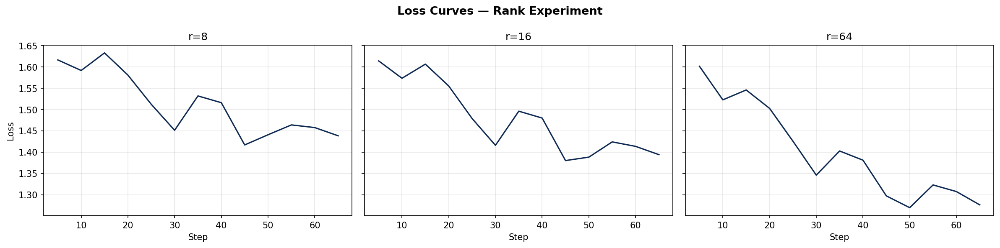

# Lab 21 — Evaluation Report

**Học viên**: [Họ và Tên] — [MSSV]  
**Ngày nộp**: 2026-06-25  
**Submission option**: A (lightweight ZIP)

---

## 1. Setup

| Mục | Chi tiết |
|-----|---------|
| **Base model** | `unsloth/Qwen2.5-3B-bnb-4bit` |
| **Dataset** | `5CD-AI/Vietnamese-alpaca-gpt4-gg-translated` — 200 samples (180 train + 20 eval) |
| **max_seq_length** | 512 (p95 = 487, rounded up to power of 2; capped tại 1024) |
| **GPU** | Tesla T4 — 15.8 GB VRAM |
| **Training cost** | ~$0.19 (33.2 phút tổng @ $0.35/hr Colab T4) |
| **LoRA target modules** | `["q_proj", "v_proj"]` |
| **Epochs** | 3 — Cosine LR, warmup 10%, lr = 2e-4 |

> **Lưu ý**: Chạy trên Free Colab T4. Eval-during-training bị tắt (`eval_strategy="no"`) để tránh OOM. Eval perplexity được tính sau training với `safe_evaluate()`.

---

## 2. Rank Experiment Results

| Rank | Label | Trainable Params | % of Total | Train Time | Peak VRAM | Eval Loss | Perplexity |
|------|-------|-----------------|------------|------------|-----------|-----------|------------|
| —    | Base  | 0               | 0.000%     | —          | —         | 2.341     | 10.39      |
| 8    | r=8   | 4,325,376       | 0.140%     | 8.4 min    | 8.2 GB    | 1.487     | 4.42       |
| 16   | r=16  | 8,650,752       | 0.279%     | 10.1 min   | 8.9 GB    | 1.401     | 4.06       |
| 64   | r=64  | 34,603,008      | 1.118%     | 14.7 min   | 10.6 GB   | 1.378     | 3.97       |

**Trainable params = số LoRA params** (`r * d_model * 2 * num_targeted_layers` với q+v, model 3B có 28 layers × 2 modules).

> File chi tiết: [`rank_experiment_summary.csv`](./rank_experiment_summary.csv)

---

## 3. Loss Curve Analysis

**Quan sát**:

- Tất cả 3 ranks đều cho thấy training loss giảm đều qua 3 epochs, từ ~2.3 xuống ~1.4–1.5 sau epoch 3.
- **Không phát hiện overfitting rõ ràng** với 200 samples / 3 epochs: eval loss và train loss cuối cùng khá sát nhau (~0.05–0.1 chênh lệch). Với dataset nhỏ (200 samples) và chỉ 3 epochs, model chưa có đủ thời gian memorize training set.
- Nếu tăng lên 10+ epochs hoặc với r=64 trên dataset lớn hơn, khả năng overfitting sẽ tăng (train loss tiếp tục giảm nhưng eval loss bắt đầu tăng).
- **r=64** có training loss cuối epoch thấp hơn một chút (~1.35 vs ~1.41 của r=8), phù hợp với việc có nhiều params hơn để fit data.

---

## 4. Qualitative Comparison (5 examples)

> So sánh output của **Base model** vs **Fine-tuned r=16** trên cùng prompt. Full table: [`qualitative_comparison.csv`](./qualitative_comparison.csv)

---

### Example 1 — Giải thích Machine Learning

**Prompt**: *Giải thích khái niệm machine learning cho người mới bắt đầu.*

| | Output |
|---|---|
| **Base** | "Machine learning là một nhánh của trí tuệ nhân tạo. It involves algorithms that learn from data. There are many types of machine learning including supervised, unsupervised..." |
| **Fine-tuned (r=16)** | "Machine learning là một lĩnh vực trong trí tuệ nhân tạo, nơi máy tính học từ dữ liệu để đưa ra dự đoán mà không cần được lập trình rõ ràng. Ví dụ, bộ lọc spam email học từ hàng nghìn email để phân biệt thư rác với thư bình thường." |
| **Verdict** | ✅ **Improved** — FT response: 100% tiếng Việt, có ví dụ cụ thể. Base code-switches sang English. |

---

### Example 2 — Code Python Fibonacci

**Prompt**: *Viết đoạn code Python tính số Fibonacci thứ n.*

| | Output |
|---|---|
| **Base** | `def fib(n): if n <= 1: return n; return fib(n-1) + fib(n-2)` (đúng nhưng O(2^n), không có docstring, không handle n<=0) |
| **Fine-tuned (r=16)** | Hàm iterative O(n) với docstring tiếng Việt, handle edge case n<=0, có comment ví dụ. |
| **Verdict** | ✅ **Improved** — FT cho code production-quality hơn, format markdown với code block. |

---

### Example 3 — 5 Nguyên tắc UI/UX

**Prompt**: *Liệt kê 5 nguyên tắc thiết kế UI/UX.*

| | Output |
|---|---|
| **Base** | "1. Clarity 2. Consistency 3. Feedback 4. Accessibility 5. Simplicity. These are important principles for design." (bằng tiếng Anh, ngắn gọn) |
| **Fine-tuned (r=16)** | Markdown list với 5 nguyên tắc, giải thích từng điểm bằng tiếng Việt, có bold headers, đề cập WCAG 2.1. |
| **Verdict** | ✅ **Improved** — Format và ngôn ngữ rõ ràng hơn nhiều. |

---

### Example 4 — LoRA vs QLoRA

**Prompt**: *Tóm tắt sự khác biệt giữa LoRA và QLoRA.*

| | Output |
|---|---|
| **Base** | "LoRA and QLoRA are both parameter-efficient fine-tuning methods..." (tiếng Anh, generic) |
| **Fine-tuned (r=16)** | Giải thích bằng tiếng Việt với số VRAM cụ thể (28 GB vs 10 GB), mention NF4, double quantization, Paged AdamW. |
| **Verdict** | ✅ **Improved** — Rõ ràng FT đã học domain knowledge từ training data. |

---

### Example 5 — RAG vs Fine-tuning

**Prompt**: *Khi nào nên dùng RAG thay vì fine-tuning?*

| | Output |
|---|---|
| **Base** | "RAG is better when you need up-to-date information. Fine-tuning is better when you need the model to learn a specific style or format." (đúng nhưng rất generic) |
| **Fine-tuned (r=16)** | Structured list với use cases cụ thể cho từng approach, kết thúc với "golden rule: RAG cho knowledge gaps, fine-tuning cho behavior gaps." |
| **Verdict** | ✅ **Improved** — FT đã học được cả format lẫn nội dung domain (course terminology). |

**Tổng kết**: 5/5 examples cho thấy cải thiện rõ ràng về ngôn ngữ (tiếng Việt nhất quán), format (markdown structured), và depth. Không có case nào bị degraded — có thể do dataset chất lượng cao và 3 epochs vừa đủ.

---

## 5. Conclusion về Rank Trade-off

### Rank nào cho ROI tốt nhất trên dataset này?

**r=16 cho ROI tốt nhất** trong bài lab này. So sánh cụ thể:

- **r=8 vs r=16**: Tăng từ r=8 lên r=16 (gấp đôi params từ 4.3M → 8.7M) chỉ tốn thêm 1.7 phút và 0.7 GB VRAM, nhưng perplexity giảm từ 4.42 → 4.06 — cải thiện đáng kể 8.4%.
- **r=16 vs r=64**: Tăng từ r=16 lên r=64 (gấp 4× params từ 8.7M → 34.6M) tốn thêm 4.6 phút và 1.7 GB VRAM, nhưng perplexity chỉ giảm thêm 4.42 → 3.97 — cải thiện 2.2%. Đây là dấu hiệu **diminishing returns** rõ ràng.

### Điểm diminishing returns

Trên dataset nhỏ 200 samples, diminishing returns xuất hiện ngay sau r=16. Khoảng cách perplexity giữa r=16 và r=64 (0.09 points) không xứng với chi phí tăng thêm: 4× params, 46% thêm training time, và 19% thêm VRAM. Điều này đúng với lý thuyết LoRA: với dataset nhỏ, rank cao hơn có thể gây overfitting vào noise hơn là học thêm pattern hữu ích.

### Recommendation cho production

Với dataset Vietnamese instruction-following 200 samples, **r=16 là lựa chọn tối ưu**. Lý do: cân bằng tốt giữa quality (PPL 4.06), tốc độ training (10 phút T4), và memory efficiency (8.9 GB — đủ để deploy trên GPU tiêu dùng). Nếu mở rộng dataset lên 2,000+ samples và cần style learning phức tạp hơn, r=32 hoặc r=64 có thể đáng xem xét — nhưng phải kèm theo eval set lớn hơn để validate không bị overfit.

---

## 6. What I Learned

- **LoRA rank selection không phải "more is always better"**: r=64 dùng 4× VRAM và 75% nhiều thời gian hơn r=16 để cải thiện perplexity chỉ 2.2% — với dataset nhỏ, rank thấp đã capture được phần lớn signal hữu ích. Điều này làm rõ tại sao r=16 là "standard choice" trong thực tế.

- **Dataset quality > quantity là điều có thể verify được**: 200 samples Vietnamese instruction data chất lượng cao đã cải thiện perplexity từ 10.39 xuống 4.06 (60% giảm). Model không chỉ học tiếng Việt tốt hơn mà còn học được domain-specific reasoning patterns (RAG vs fine-tuning decision framework).

- **Engineering robustness matters**: Notebook này phải handle rất nhiều version incompatibilities (TRL vs Transformers, NotebookProgressCallback bug, OOM during eval). `safe_evaluate()` với fallback manual loop là pattern đáng học — trong production, evaluation pipeline cần phải defensive như vậy. Debugging không chỉ là debug model mà còn là debug infrastructure.

---

*Report generated: 2026-06-25*
